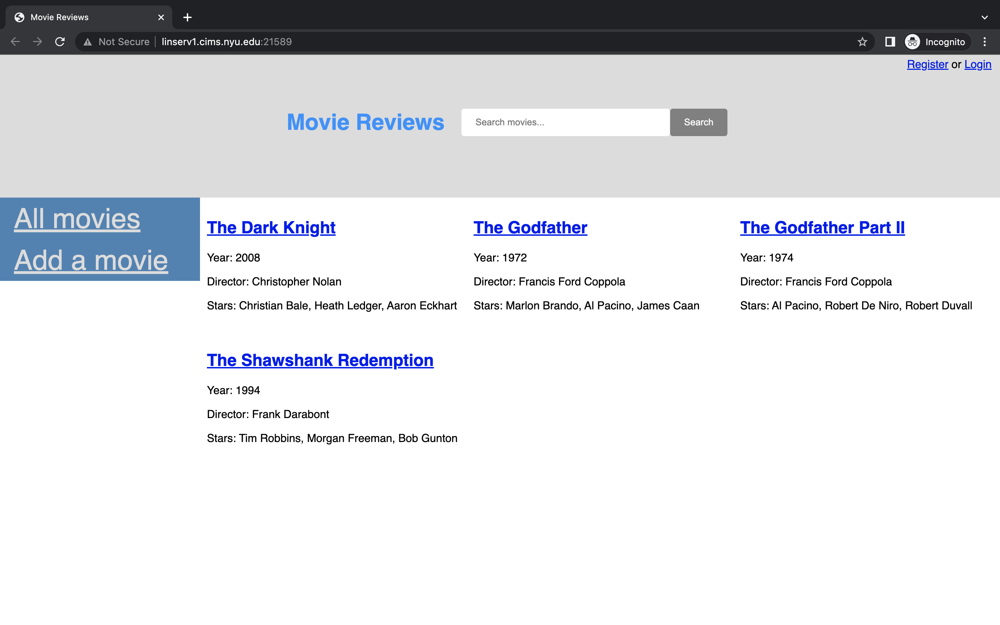
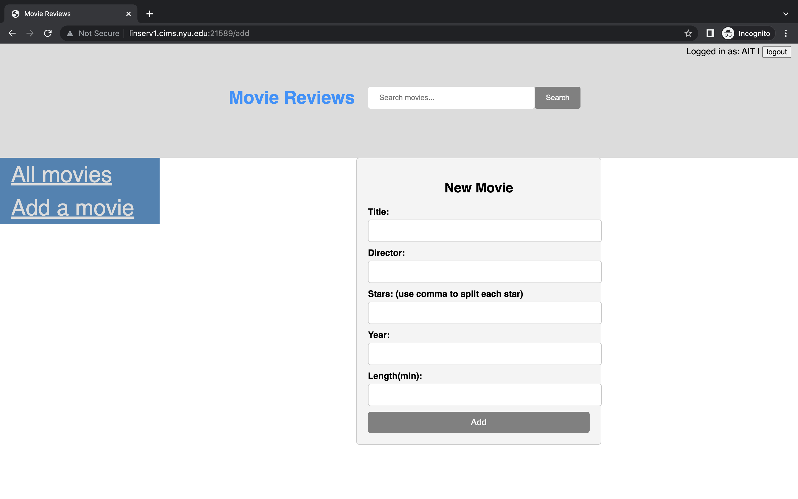
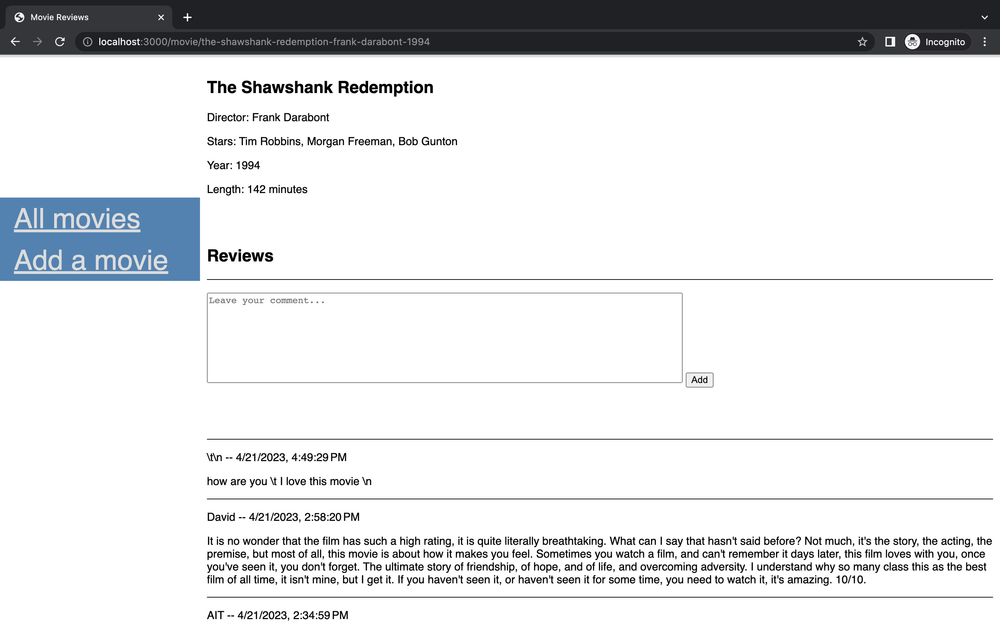
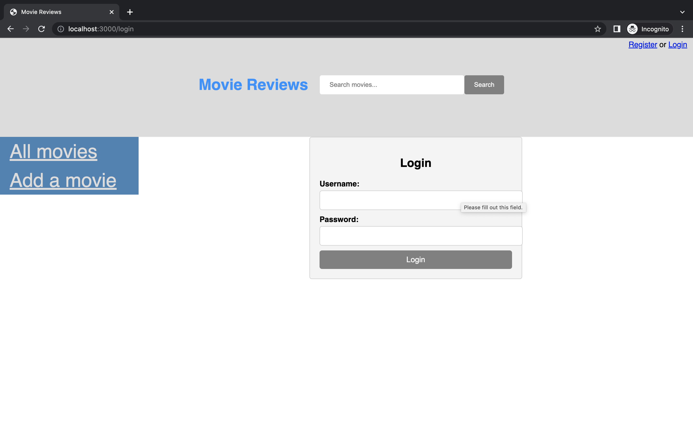
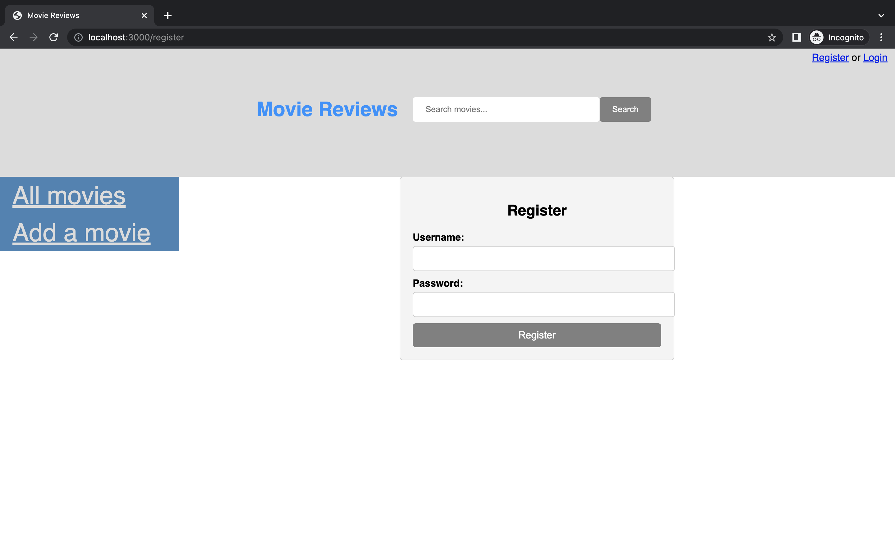
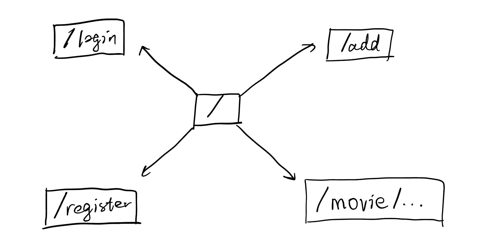
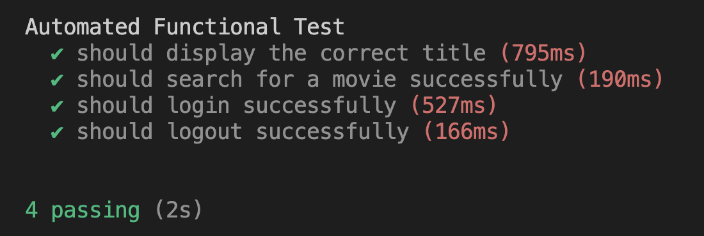

# Movie Reviews 

## Overview

It's way too difficult to choose the movie you like among tons of movies. It is unrealistic for a person to watch all the movies to find his/her favorite. Therefore, movie reviews provide much convenience for people to get to know the basic knowledge of each movie and find their favorite ones.

Movie Reviews is a web app that will allow users to search for movies and read movie reviews from other users. Users can register and login. Once they're logged in, they can add movies that are not in the database and add their reviews to any movie.

## Data Model

The application will store Users, Movies and Reviews.

* each movie can have multiple reviews (via references)
* each user can have multiple reviews (via references)

An Example User:

```javascript
{
  username: "Messi",
  hash: // a password hash,
  reviews: // an array of references to Review documents
}
```

An Example Movie:

```javascript
{
  title: "The Shawshank Redemption",
  director: "Frank Darabont",
  stars: ["Tim Robbins", "Morgan Freeman", "Bob Gunton"],
  year: 1994,
  length: 142
  reviews: // an array of references to Review documents
  slug: "the-shawshank-redemption-frank-darabont-1994" // implemented by slug plugin
}
```

An Example Review:

```javascript
{
  user: // a reference to a User object
  content: "Some birds aren't meant to be caged.",
  createdAt: // timestamp
}
```

## [Link to Commented Schema](src/db.mjs) 

## Wireframes

/ - page for viewing all movies



/add - page for adding movies



/movie/... - page for showing specific movie and reviews for the movie



/login - page for user to login



/register - page for user to register



## Site map



## User Stories or Use Cases

1. as non-registered user, I can register a new account on the site
2. as non-registered user, I can view all the movies on the site
3. as non-registered user, I can search for specific movies on the site
4. as non-registered user, I can view all the reviews of a specific movie on the site
5. as registered user, I can login to the site
6. as a registered user, I can post my review to a specific movie
7. as a registered user, I can add a movie to the database

## Research Topics

* (5 points) Integrate user authentication
    * I'm going to be using passport for user authentication
* (5 points) Selenium for automated functional testing
    * used Mocha and Selenium in headless mode as the automated functional testing tool to ensure the web application functions well
    * Test Result
    

10 points total out of 10 required points


## [Link to Main Project File](src/app.mjs) 

## Annotations / References Used

1. [passport.js authentication docs](http://passportjs.org/docs)
2. [tutorial on Selenium](https://github.com/SeleniumHQ/selenium/tree/trunk/javascript/node/selenium-webdriver)

